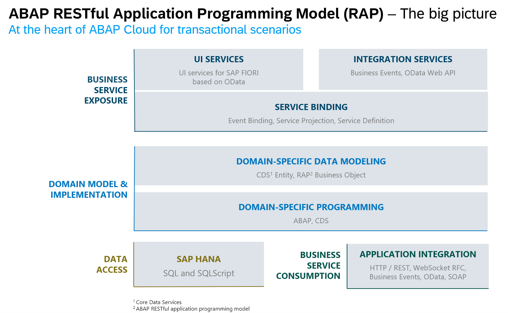
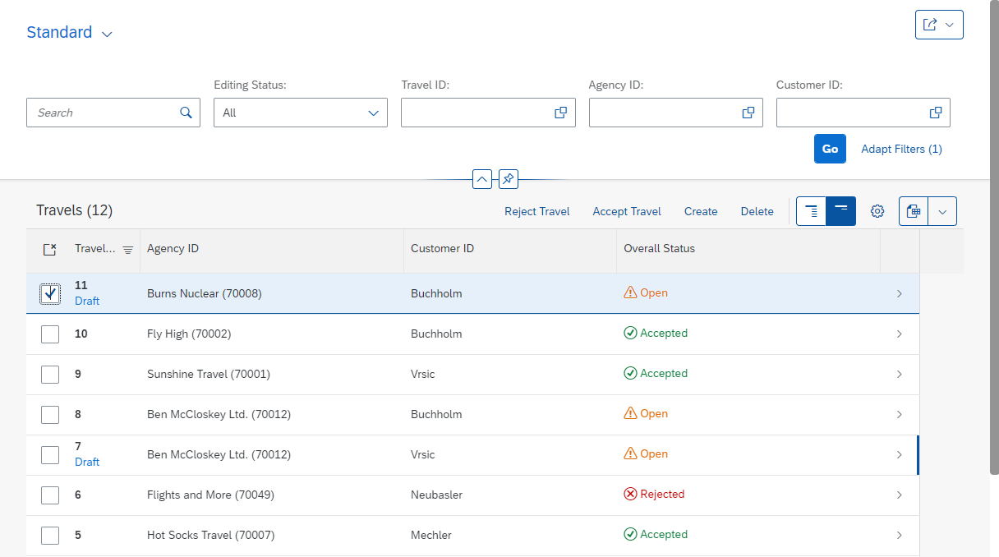
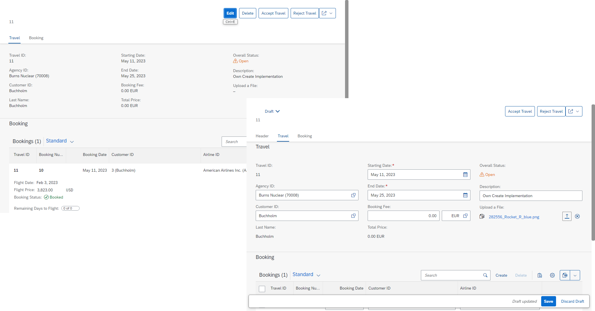
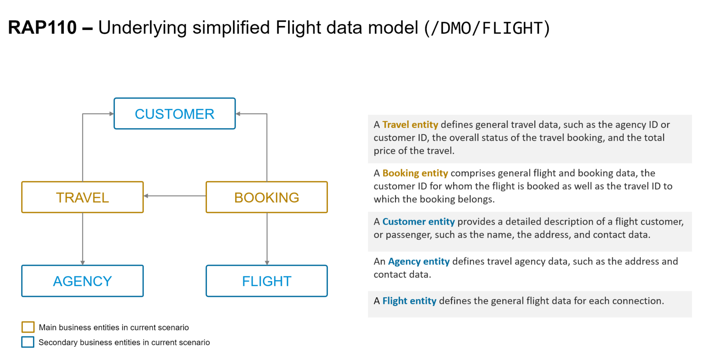

# AD181v - Delve into ABAP Cloud on SAP BTP ABAP environment

## Description

This repository contains the material for the SAP TechEd 2023 session called AD181v - Delve into ABAP Cloud on SAP BTP ABAP environment.  

The ABAP RESTful application programming model (RAP) is at the heart of the ABAP Cloud development model for building transactional, cloud-ready apps and services on SAP BTP, ABAP environment and SAP S/4HANA, in the cloud and on premise. Learn how to use RAP features, such as late numbering, side effects, and business events, to build your own SAP Fiori apps. We focus on the development capabilities in the ABAP development tools. 

## Overview

In this Jump-Start session, participants will learn how to use the core features of the ABAP RESTful application programming model (RAP) to build modern, cloud-ready, transactional SAP Fiori applications and services.

This section provides a brief introduction to RAP and to the current business scenario.

  
Click to expand!

#### About the ABAP RESTful Application Programming Model (RAP)
   
> **ABAP Cloud** is the development model for building cloud-ready business apps, services and extensions on SAP BTP and all SAP S/4HANA editions, i.e. public or private cloud, and even on-premise.
>
> The **ABAP RESTful Application Programming Model (RAP)** is the centerpiece of _ABAP Cloud development model_ for building transactional, cloud-ready SAP Fiori apps and Web APIs. RAP offers a set of concepts, tools, languages, and powerful frameworks provided on the ABAP platform. It supports the efficient development of innovative and cloud-ready enterprise applications, as well as the extension of SAP standard applications in an upgrade-stable way in the cloud and on-premise.

Click to expand!

RAP is an enabler for improving the user experience and innovating business processes in ABAP-based SAP solutions by leveraging SAP Fiori, SAP HANA, and the cloud. 
It is a long-term strategic solution for ABAP development on SAP’s flagship product SAP S/4HANA, in the cloud and on-premise (as of release 1909), as well as on the SAP BTP ABAP Environment.

The illustration below shows the high-level end-to-end development stack when working with RAP.  

**Learn more**:  
 * [State-of-the-Art ABAP Development with the ABAP RESTful Application Programming Model (RAP) | SAP Community](https://community.sap.com/topics/abap/rap)
 * [About the ABAP Cloud Development Model and SAP S/4HANA (Cloud) Extensibility](https://blogs.sap.com/2023/05/26/abap-cloud-sap-s-4hana-extensibility-may-2023-update/)

### Business Scenario

> In this hands-on session we will guide you through the development of the OData service of a SAP Fiori elements based _Travel Processing App_ with RAP, using the _managed_ business object (BO) runtime implementation with semantic key and late numbering. We will give you more details on the scenario in the different exercises.
>   
> The OData service you are going to implement is based on the _ABAP Flight Reference Scenario_. To set the business context, the scenario is the following: The department responsible for managing worldwide Travels for multiple Agencies is requesting you to build a new Fiori app with draft capabilities for processing (i.e. creating, updating and deleting) Travels. 
  

  
Click to expand!

   
The resulting _Travel_ app is a SAP Fiori elements-based List Report app with search, filter, and draft capabilities for processing travel bookings. A navigation to an Object Page for displaying the details of each _travel_ entry in the list report is offered.

that will look like this:

**List Report**:

  
**Object Page**: 

Below is the simplified _Flight_ data model underlying the app.

## Requirements

The requirements to follow the exercises in this repository are:
1. [Create an user on the SAP BTP ABAP Environment Trial](https://developers.sap.com/tutorials/abap-environment-trial-onboarding.html)
2. [Install the latest Eclipse platform and the latest ABAP Development Tools (ADT) plugin](https://developers.sap.com/tutorials/abap-install-adt.html)

## Exercises

Start the exercises [here](https://github.tools.sap/D040081/rap_workshops/blob/master/rap1xx/rap110/README.md#-exercises).

## Presentation & Replay

Access the ...
- Session presentation: [AD181v@SAP_TechEd_2023.pdf (coming soon](/exercises/images/AD181v@SAP_TechEd_2023.pdf)
- Session replay (_login required_)

## Related ressources
 - 📃 [State-of-the-Art ABAP Development with the ABAP RESTful Application Programming Model (RAP) | SAP Community](https://community.sap.com/topics/abap/rap)
 - 📄 [ABAP Cloud – SAP S/4HANA extensibility – May 2023 update | SAP Blogs](https://blogs.sap.com/2023/05/26/abap-cloud-sap-s-4hana-extensibility-may-2023-update/)
 - 🛠 [Develop and Run a Fiori Application with SAP Business Application Studio | SAP Tutorials](https://developers.sap.com/tutorials/abap-environment-deploy-cf-production.html)
 - 
## Contributing
Please read the [CONTRIBUTING.md](./CONTRIBUTING.md) to understand the contribution guidelines.

## Code of Conduct
Please read the [SAP Open Source Code of Conduct](https://github.com/SAP-samples/.github/blob/main/CODE_OF_CONDUCT.md).

## How to obtain support

Support for the content in this repository is available during the actual time of the online session for which this content has been designed. Otherwise, you may request support via the [Issues](../../issues) tab.

## License
Copyright (c) 2023 SAP SE or an SAP affiliate company. All rights reserved. This project is licensed under the Apache Software License, version 2.0 except as noted otherwise in the [LICENSE](LICENSES/Apache-2.0.txt) file.
